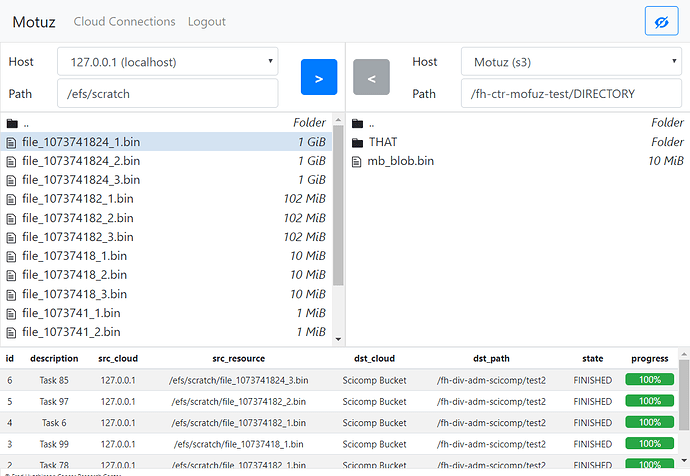

# Motuz

A web based infrastructure for large scale data movements between on-premise and cloud




## Developer Installation

1. Install system dependencies (tested with Ubuntu 18.04)

```bash
sudo apt-get install python3

and then follow these instructions:
    https://docs.docker.com/install/linux/docker-ce/ubuntu/

# Work in progres... unsure what else is needed on a blank system. Might use docker soon
```

2. Initialize app

```bash
./bin/init.sh
```

---

3. Start RabbitMQ

```bash
./bin/rabbitmq_start.sh
```

4. Start Celery

```bash
./bin/celery_start.sh
```

5. Start Backend

```bash
./bin/backend_start.sh
```

6. Start Frontend

```bash
./bin/frontend_start.sh
```

## Development Options

1. Changing the host

```bash
MOTUZ_HOST='0.0.0.0' ./bin/frontend_start.sh
MOTUZ_HOST='0.0.0.0' ./bin/backend_start.sh
```

## Folder structure


### Overview

| Folder | Description |
| --- | --- |
| `bin/` | Scripts for starting / installing / testing the application |
| `docs/` | Documentation |
| `sandbox/` | Temporary place for Proof of Concept code |
| `src/` | All source code in one place |
| `src/frontend/` | Frontend code |
| `src/backend/` | Backend code |
| `test/` | All test code in one place |
| `test/frontend/` | Frontend testing |
| `test/backend/` | Backend testing |


### Frontend folder structure (inside /src/frontend)

| Folder | Description |
| --- | --- |
| `css/` | Styling |
| `img/` | Images |
| `js/` | ReactJS Code |
| `js/actions/` | Redux Actions |
| `js/components/` | Reusable React Components |
| `js/managers/` | Reusable React Utilities |
| `js/middleware/` | React middleware |
| `js/reducers/` | Redux Reducers |
| `js/utils/` | Independent JavaScript Utilities |
| `js/views/` | Motuz-Specific view and business logic |
| `webpack/` | Webpack configurations (For JS bundling) |


### Backend folder structure (inside /src/backend)

| Folder | Description |
| --- | --- |
| `api/` | Code for the API (Swagger) Module |
| `api/managers/` | Utilities that the views call to perform actions (Also called services in Flask) |
| `api/models/` | Database Models |
| `api/views/` | API Endpoints for Swagger |
| `api/serializers.py` | DTOs - They define the Data Input expectations for Swagger |
| `migrations/` | Database Migrations |


### Temp folders

Additional temporary folders - ignore and do not commit

| Folder | Description |
| --- | --- |
| `__pycache__/` | Python Bytecode |
| `node_modules/` | JavaScript dependencies |
| `venv/` | Python dependencies |


## Setting up production

### On-premises setup

Refer to [machine-setup.md](machine-setup.md).

### AWS EC2 setup


Based on https://medium.com/@cjus/installing-docker-ce-on-an-aws-ec2-instance-running-ubuntu-16-04-f42fe7e80869


Inside a fresh EC2 instance

```bash
curl -fsSL https://download.docker.com/linux/ubuntu/gpg | sudo apt-key add -
sudo add-apt-repository "deb [arch=amd64] https://download.docker.com/linux/ubuntu $(lsb_release -cs) stable"
sudo apt-get update
sudo apt-get install -y docker-ce
sudo apt-get install -y docker-compose

sudo useradd -d /home/aicioara -m aicioara
echo 'aicioara:ThisIsNotSecure' | sudo chpasswd


```

Making some test files

```bash
for size in {107374,1073741,10737418,107374182,1073741824}; do
    for i in $(seq 1 3); do
        filename="file_${size}_${i}.bin"
        echo "$filename"
        head -c "$size" < /dev/urandom > "$filename"
    done
done

```

### Initializing the database

While the database container is running

```
docker-compose run --entrypoint='bash' database
root@0:/# psql -h 0.0.0.0 -U postgres -d postgres

create database motuz;
create user motuz_user with password 'motuz_password';
grant all privileges on database motuz to motuz_user;
```