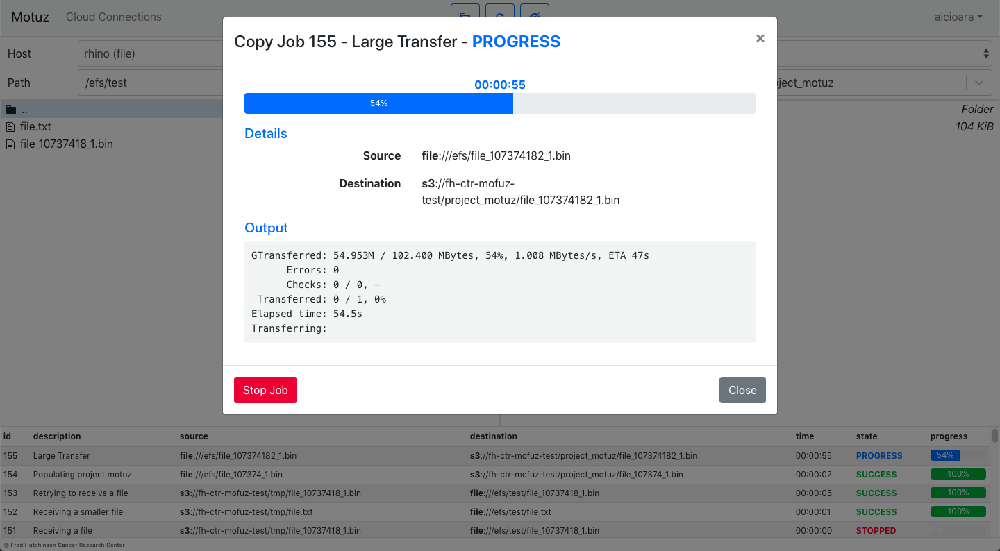

<div align="center">
    
    <h1>Motuz</h1>
    <p>
        <b>A web based infrastructure for large scale data movements between on-premise and cloud</b>
    </p>
    <br>
</div>



## Quickstart

1. [Install docker and docker-compose](https://docs.docker.com/install/linux/docker-ce/ubuntu/)
2. Create a folder called docker in your root directory `sudo mkdir /docker`.
3. Add SSL certificates inside `/root/certs`
4. Run the start script

```bash
./start.sh
```

5. See result at http://localhost/.

---


---

## Examples

### How to use the API

Once started, the API can be found at `localhost:5000/api/`. There is a Swagger Front End that makes the API easy to explore.

### Authentication

- POST requests to `/api/auth/login/` with correct credentials will issue an `access_token` and a `refresh_token` (called `access` and `refresh` in the JSON response)

- Protected API points can then be accessed by providing the `access_token` as an Authorization header. Example header:
    - Authorization: Bearer `access_token`

- The `access_token` can be provided to Swagger using the "Authorize" button an the top-right and inserting `Bearer $access_token` in the box, where $access_token is the value returned for key "access" in step 1

- The `access_token` is only valid for a limited amount of time (usually 6 hours). Upon expiration, a new `access_token` can be obtained by issuing a POST request to `/api/auth/refresh/` using the `refresh_token` in the Authorization field. Example:
    - Authorization: Bearer `refresh_token`

- The `refresh_token` has longer validity, say T days. Please note that the `POST /api/auth/refresh/` endpoint issues a new `refresh_token` as well, so if the users login at least once every T days, they will never be logged out.


## Developer Installation

### Initialize

1. Install system dependencies (tested with Ubuntu 18.04 and MacOS 10.14)

- [Docker](https://docs.docker.com/install/linux/docker-ce/ubuntu/)
- Python ~ 3.7
- Node ~ 10.15


2. Initialize app

```bash
./bin/init.sh
```

### Start

1. Start Database

```bash
./bin/database_start.sh
```

2. Start RabbitMQ

```bash
./bin/rabbitmq_start.sh
```

3. Start Celery

```bash
./bin/celery_start.sh
```

4. Start Backend

```bash
./bin/backend_start.sh
```

5. Start Frontend

```bash
./bin/frontend_start.sh
```

6. See result at http://localhost:8080/

## Development Options

1. Changing the host

```bash
MOTUZ_HOST='0.0.0.0' ./bin/frontend_start.sh
MOTUZ_HOST='0.0.0.0' ./bin/backend_start.sh
```

## Folder structure


### Overview

| Folder | Description |
| --- | --- |
| `bin/` | Scripts for starting / installing / testing the application |
| `docker/` | Container definition for production |
| `docs/` | Documentation |
| `sandbox/` | Temporary place for Proof of Concept code |
| `src/` | All source code in one place |
| `src/frontend/` | Frontend code |
| `src/backend/` | Backend code |
| `test/` | All test code in one place |
| `test/frontend/` | Frontend testing |
| `test/backend/` | Backend testing |


### Frontend folder structure (inside `/src/frontend/`)

| Folder | Description |
| --- | --- |
| `css/` | Styling |
| `img/` | Images |
| `js/` | ReactJS Code |
| `js/actions/` | Redux Actions |
| `js/components/` | Reusable React Components |
| `js/managers/` | Reusable React Utilities |
| `js/middleware/` | React middleware |
| `js/reducers/` | Redux Reducers |
| `js/utils/` | Independent JavaScript Utilities |
| `js/views/` | Motuz-Specific view and business logic |
| `webpack/` | Webpack configurations (For JS bundling) |


### Backend folder structure (inside `/src/backend/`)

| Folder | Description |
| --- | --- |
| `api/` | Code for the API (Swagger) Module |
| `api/managers/` | Utilities that the views call to perform actions (Also called services in Flask) |
| `api/mixins/` | Flask Mixins for Database Models |
| `api/models/` | Database Models |
| `api/utils/` | Standalone helper code. Could be inside its own repository |
| `api/views/` | API Endpoints for Swagger |
| `migrations/` | Database Migrations |


### Temp folders

Additional temporary folders - ignore and do not commit

| Folder | Description |
| --- | --- |
| `__pycache__/` | Python Bytecode |
| `node_modules/` | JavaScript dependencies |
| `venv/` | Python dependencies |


## Setting up production

### On-premises setup

Refer to [machine-setup.md](docs/machine-setup.md).


### AWS EC2 setup

1. Install Docker. ([Read more](https://medium.com/@cjus/installing-docker-ce-on-an-aws-ec2-instance-running-ubuntu-16-04-f42fe7e80869))

```bash
curl -fsSL https://download.docker.com/linux/ubuntu/gpg | sudo apt-key add -
sudo add-apt-repository "deb [arch=amd64] https://download.docker.com/linux/ubuntu $(lsb_release -cs) stable"
sudo apt-get update
sudo apt-get install -y docker-ce
sudo apt-get install -y docker-compose
```

2. AWS EC2 purge and deploy / redeploy

```bash
cd /path/to/motuz/folder
./bin/prod/redeploy.sh
```


## Other resources

- [Server Recepies](docs/server-recepies.md)
